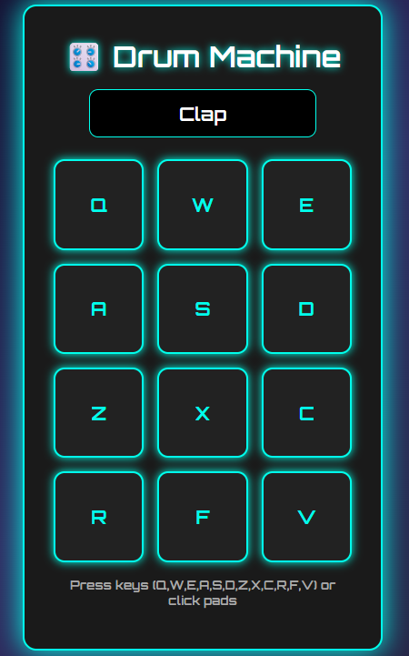

# 🥁 Drum Machine

A sleek, interactive **Drum Machine** built with **React** and **Vite** as part of the **FreeCodeCamp Front End Development Libraries Project**.  
Play sounds with keyboard keys or mouse clicks, control volume, and enjoy a responsive UI designed for all devices.

---

## 🚀 Live Demo

[🔗 View Demo](https://drum-machine-tan-nine.vercel.app/)

---
## 📸 Screenshot


---

## ✨ Features

- 🎹 **Interactive Pads** – Play drum sounds via mouse clicks or keyboard keys.
- 🔊 **Volume Control** – Adjust playback volume with an intuitive slider.
- 🎧 **Responsive Design** – Works seamlessly on desktop, tablet, and mobile.
- ⚡ **Fast & Lightweight** – Powered by **Vite** for blazing-fast performance.
- 💻 **Modern UI** – Clean and user-friendly interface with polished styling.

---

## ⚙️ Built With

- **React** – Front-end UI library  
- **Vite** – Next-gen build tool for fast development  
- **CSS3** – Responsive styling and animations  
- **JavaScript (ES6)** – Core application logic  
- **FreeCodeCamp Drum Machine Project Requirements**

---

## 📂 Project Structure
```bash 
drum-machine
├── README.md
├── eslint.config.js
├── index.html
├── package-lock.json
├── package.json
├── public             #Static assets
│   ├── screenshot.png
│   └── vite.svg
├── src
│   ├── App.css  
│   ├── App.jsx   #main app component
│   ├── DrumPad.jsx
│   ├── assets
│   │   └── react.svg
│   ├── index.css  # Styles
│   └── main.jsx
└── vite.config.js
```
---

---

## 🛠️ Installation & Setup

### 1. Clone the repository
   ```bash
   git clone https://github.com/Stabat47/drum-machine.git
   cd drum-machine
 ```
### 2. Install Dependencies
```bash 
npm install
```
### 3. start Server
```bash
npm run dev
```
---
## 📖 How to Use

- Click on any drum pad or press the corresponding **keyboard key** to play a sound.

- Adjust the volume slider to set your preferred sound level.

- The display updates in real-time to show which pad is active.
---

## 🙌 Acknowledgments

- Inspired by [FreeCodeCamp Front End Development Libraries Project](https://www.freecodecamp.org/).

- Sound assets sourced from free-to-use audio libraries.

- Design inspired by **minimalist music production gear.**
---
## 📝 License

This project is licensed under the **MIT License** – feel free to use, modify, and distribute it.

---

## 👤 Author
**Landoh Clansy**
GitHub:[@Stabat47](github.com/Stabat47)
